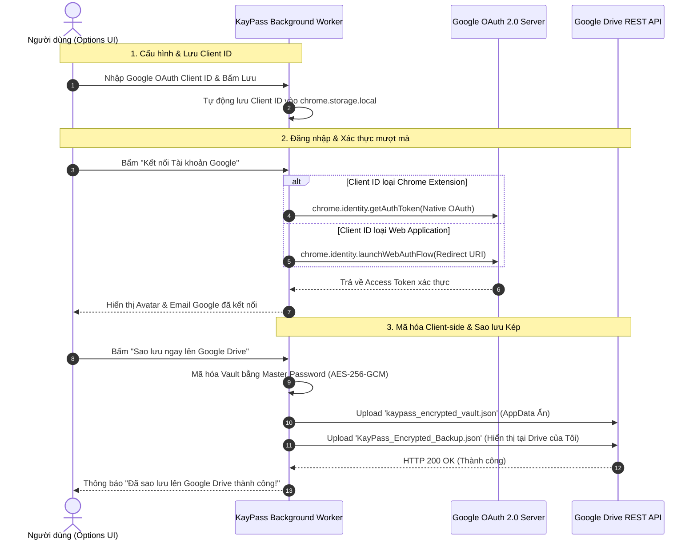

# 🔐 KayPass - Chrome Extension Quản lý Mật khẩu Mã hóa & Đồng bộ Google Drive

**KayPass** là tiện ích mở rộng trên Google Chrome (Manifest V3) hỗ trợ lưu trữ tài khoản/mật khẩu an toàn với cơ chế **Mã hóa Client-Side Zero-Knowledge (AES-256-GCM)**, tự động điền form đăng nhập, cùng khả năng sao lưu dữ liệu đã mã hóa trực tiếp lên **Google Drive (Dual-Mode OAuth)** và **Server Bên Thứ Ba**.

---

## 🌟 Tính năng Nổi bật

- 🛡️ **Mã hóa Zero-Knowledge (AES-256-GCM)**: Dữ liệu mật khẩu của bạn được mã hóa hoàn toàn trên trình duyệt bằng PBKDF2 (100,000 vòng lặp) trước khi lưu trữ hoặc đẩy lên mây. Phía Google Drive / Server bên thứ 3 chỉ lưu giữ bản mã hóa (Ciphertext ngẫu nhiên), không bao giờ có thể đọc được mật khẩu gốc.
- 🔑 **Ràng buộc Duy nhất Cặp (URL + Username)**: Đảm bảo không trùng lặp tài khoản cho cùng một trang web. Mỗi tài khoản theo URL và tên đăng nhập luôn duy nhất.
- ⚡ **Tự động điền (Autofill 1-Click)**: Tự động phát hiện ô đăng nhập trên trang web hiện tại và điền chính xác tài khoản/mật khẩu, hỗ trợ tốt các SPA framework (React, Vue, Angular).
- 🌐 **Đồng bộ Google OAuth 2.0 Linh hoạt (Dual-Mode OAuth)**: 
  - Hỗ trợ linh hoạt cả 2 loại Client ID: **Chrome Extension** (Xác thực gốc mượt mà) và **Web Application** (WebAuthFlow).
  - Tự động lưu giữ Client ID cá nhân trong bộ nhớ máy, không bị mất khi reload trang.
  - Tự động làm mới Token (Auto-Refresh Token) khi hết hạn (tránh lỗi HTTP 401).
- ☁️ **Sao lưu Đa chế độ Google Drive (AppData Ẩn + Drive của Tôi)**: 
  - Lưu tệp mã hóa ẩn `kaypass_encrypted_vault.json` trong thư mục ứng dụng (AppData).
  - Tự động tạo tệp hiển thị `KayPass_Encrypted_Backup.json` ngay trên trang chính Google Drive của bạn (`drive.google.com`).
- 🌐 **Lưu trữ Server / Webhook Bên Thứ Ba**: Hỗ trợ đẩy bản mã hóa qua HTTP POST đến API / Webhook tùy chỉnh.
- 📥 **Xuất & Nhập tệp JSON Mã hóa**: Tải bản sao lưu mã hóa về máy hoặc nhập khôi phục dễ dàng với đối soát chống trùng lặp.
- 🎲 **Trình tạo Mật khẩu Ngẫu nhiên An toàn**: Sinh mật khẩu mạnh với đầy đủ tùy chọn độ dài, chữ hoa/thường, số và ký tự đặc biệt.
- 🎨 **Giao diện Hiện đại Glassmorphism (Dark Mode)**: Sắc nét, tối ưu trải nghiệm người dùng.

---

## 🏗️ Cấu trúc Thư mục Dự án

```
kaypass/
├── manifest.json         # Cấu hình Chrome Extension Manifest V3 & OAuth2 Native
├── background.js          # Service Worker xử lý Session, Crypto, Auto-Refresh Token & Drive REST API
├── js/
│   └── crypto.js          # Thư viện Crypto (Web Crypto API: PBKDF2 + AES-256-GCM)
├── content/
│   └── content.js         # Content Script tự động nhận diện & điền form đăng nhập
├── popup/
│   ├── popup.html         # Giao diện chính của tiện ích
│   ├── popup.css          # Styling Dark Mode Glassmorphism
│   └── popup.js           # Logic điều khiển Vault, tìm kiếm, Autofill & Password Generator
├── options/
│   ├── options.html       # Trang Cài đặt, Cấu hình Client ID, Google Drive & Webhook
│   ├── options.css        # Styling cho trang Cài đặt
│   └── options.js         # Logic kết nối Google OAuth2, Lưu trữ Client ID & Export/Import
└── icons/                 # Bộ icon tiện ích (16x16, 48x48, 128x128)
```

---

## 🔄 Quy trình Hoạt động Đồng bộ Google OAuth2 & Google Drive



---

## 🛠️ Hướng dẫn Cài đặt & Sử dụng

### Bước 1: Cài đặt tiện ích vào Chrome
1. Tải hoặc clone thư mục `kaypass` về máy.
2. Mở Chrome và truy cập: `chrome://extensions/`
3. Bật **Chế độ dành cho nhà phát triển (Developer mode)** ở góc trên bên phải.
4. Bấm **Tải tiện ích đã giải nén (Load unpacked)** và chọn thư mục `kaypass`.

### Bước 2: Tạo Google Client ID trên Google Cloud Console
1. Truy cập [Google Cloud Console](https://console.cloud.google.com/) > Tạo Project mới.
2. Vào **APIs & Services** > **Library** > Tìm `Google Drive API` > Bấm **Enable**.
3. Vào **OAuth consent screen** / **Audience** > Thêm email của bạn vào mục **Test users** (hoặc bấm **Publish App** để không bị hạn chế).
4. Vào **Credentials** > **Create Credentials** > **OAuth client ID**:
   - *Cách 1 (Khuyên dùng - Loại Chrome Extension)*: Chọn **Chrome Extension** > Nhập Item ID (ID tiện ích trên máy bạn) > Bấm Create.
   - *Cách 2 (Loại Web Application)*: Chọn **Web Application** > Dán Authorized redirect URI từ trang Cài đặt KayPass (`https://<EXTENSION_ID>.chromiumapp.org/`) > Bấm Create.

### Bước 3: Kết nối & Trải nghiệm
1. Mở trang Cài đặt KayPass > Dán mã **Client ID** vào ô > Bấm **Lưu Client ID**.
2. Bấm **"Kết nối Tài khoản Google"** > Chọn tài khoản Google của bạn.
3. Bấm **"☁️ Sao lưu ngay lên Google Drive"**.
4. Truy cập [drive.google.com](https://drive.google.com/) để thấy tệp **`KayPass_Encrypted_Backup.json`** xuất hiện trực tiếp trên trang chính Google Drive của bạn!

---

## ❓ Thường gặp & Xử lý lỗi (Troubleshooting)

| Lỗi | Nguyên nhân | Cách xử lý |
| :--- | :--- | :--- |
| `Lỗi 403: access_denied` | Email chưa được thêm vào Test users | Vào Google Cloud Console > Audience > Thêm Email vào Test users hoặc bấm Publish App. |
| `Error 400: redirect_uri_mismatch` | Client ID loại Web App thiếu Redirect URI | Copy Redirect URI từ trang Cài đặt KayPass dán vào Authorized redirect URIs trên Google Cloud. |
| `HTTP 401 Unauthorized` | Token hết hạn | Bấm **Đăng xuất** rồi bấm **Kết nối Tài khoản Google** lại để lấy token mới. |

---

## 🔒 Cơ chế Bảo mật (Security Architecture)

1. **Khóa Master (Master Password)**: Mật khẩu Master không bao giờ lưu trữ trên disk hay gửi qua mạng.
2. **PBKDF2 Key Derivation**: Tạo khóa giải mã AES-256 từ Master Password với 100,000 vòng lặp và Salt ngẫu nhiên 16-byte.
3. **Mã hóa AES-256-GCM**: Dữ liệu lưu trữ được mã hóa với IV ngẫu nhiên 12-byte, đảm bảo tính toàn vẹn và bảo mật cao nhất.
4. **Session Auto-Lock**: Tự động khóa Vault và xóa Master Key khỏi RAM sau 15 phút không hoạt động.

---

## 📄 Giấy phép (License)

Dự án được phát hành theo giấy phép MIT.
