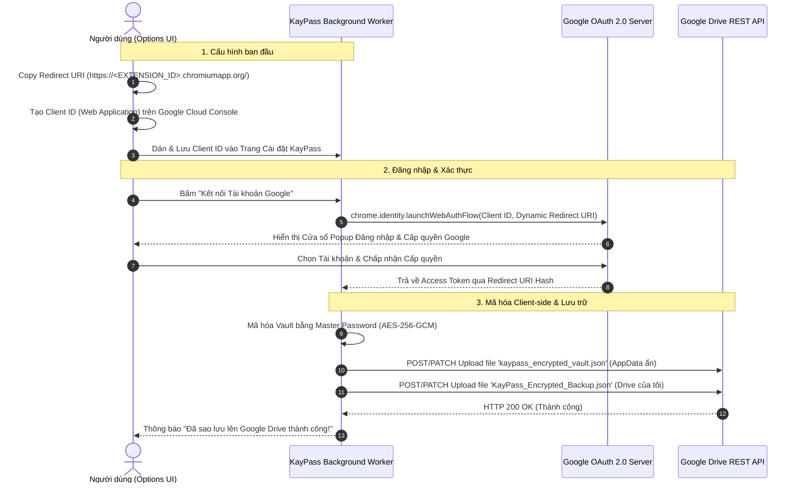

# 🔐 KayPass - Chrome Extension Quản lý Mật khẩu Mã hóa & Đồng bộ Google Drive

**KayPass** là tiện ích mở rộng trên Google Chrome (Manifest V3) hỗ trợ lưu trữ tài khoản/mật khẩu an toàn với cơ chế **Mã hóa Client-Side Zero-Knowledge (AES-256-GCM)**, tự động điền form đăng nhập, cùng khả năng sao lưu dữ liệu đã mã hóa trực tiếp lên **Google Drive (Cấu hình OAuth 2.0 Động cho Mọi Người dùng)** và **Server Bên Thứ Ba**.

---

## 🌟 Tính năng Nổi bật

- 🛡️ **Mã hóa Zero-Knowledge (AES-256-GCM)**: Dữ liệu mật khẩu của bạn được mã hóa hoàn toàn trên trình duyệt bằng PBKDF2 (100,000 vòng lặp) trước khi lưu trữ hoặc đẩy lên mây. Phía Google Drive / Server bên thứ 3 chỉ lưu giữ bản mã hóa (Ciphertext ngẫu nhiên), không bao giờ có thể đọc được mật khẩu gốc.
- 🔑 **Ràng buộc Duy nhất Cặp (URL + Username)**: Đảm bảo không trùng lặp tài khoản cho cùng một trang web. Mỗi tài khoản theo URL và tên đăng nhập luôn duy nhất.
- ⚡ **Tự động điền (Autofill 1-Click)**: Tự động phát hiện ô đăng nhập trên trang web hiện tại và điền chính xác tài khoản/mật khẩu, hỗ trợ tốt các SPA framework (React, Vue, Angular).
- 🌐 **Cấu hình Google OAuth 2.0 Động 100% (Dynamic Client ID & Redirect URI)**: Bất kỳ ai khi cài đặt KayPass trên máy tính khác cũng có thể tự gắn Client ID cá nhân và tự động tính toán Redirect URI duy nhất để đồng bộ Google Drive của họ.
- ☁️ **Đồng bộ Google Drive Đa chế độ (Hidden AppData + Visible My Drive)**: Tự động lưu bản mã hóa ẩn vào AppData và tạo file hiển thị `KayPass_Encrypted_Backup.json` tại trang chính Google Drive của bạn.
- 🌐 **Lưu trữ Server / Webhook Bên Thứ Ba**: Hỗ trợ đẩy bản mã hóa qua HTTP POST đến API / Webhook tùy chỉnh.
- 📥 **Xuất & Nhập tệp JSON Mã hóa**: Tải bản sao lưu mã hóa về máy hoặc nhập khôi phục dễ dàng với đối soát chống trùng lặp.
- 🎲 **Trình tạo Mật khẩu Ngẫu nhiên An toàn**: Sinh mật khẩu mạnh với đầy đủ tùy chọn độ dài, chữ hoa/thường, số và ký tự đặc biệt.
- 🎨 **Giao diện Hiện đại Glassmorphism (Dark Mode)**: Sắc nét, tối ưu trải nghiệm người dùng.

---

## 🔄 Quy trình Hoạt động Đồng bộ Google OAuth2 Động

Sơ đồ trình tự biểu diễn luồng xác thực Google OAuth 2.0 động (WebAuthFlow) giữa Trình duyệt người dùng, KayPass Service Worker và Google Cloud API:

---

## 🛠️ Hướng dẫn Cài đặt & Cấu hình cho Mọi Người Dùng

### Bước 1: Cài đặt tiện ích vào Chrome
1. Tải thư mục mã nguồn `kaypass` về máy.
2. Mở Chrome và truy cập: `chrome://extensions/`
3. Bật **Chế độ dành cho nhà phát triển (Developer mode)** ở góc trên bên phải.
4. Bấm nút **Tải tiện ích đã giải nén (Load unpacked)** và chọn thư mục `kaypass`.

### Bước 2: Tạo Google Client ID Cá nhân (Chỉ mất 1 phút)
1. Truy cập [Google Cloud Console](https://console.cloud.google.com/) > Tạo Project mới.
2. Vào **APIs & Services** > **Library** > Tìm `Google Drive API` > Bấm **Enable**.
3. Vào **OAuth consent screen** / **Audience** > Thêm email của bạn vào mục **Test users** (hoặc bấm **Publish App**).
4. Vào **Credentials** > **Create Credentials** > **OAuth client ID**:
   - Chọn **Application type**: **Web application**.
   - Mục **Authorized redirect URIs**: Bấm **+ ADD URI** và dán đường dẫn **Authorized Redirect URI** (lấy từ trang Cài đặt KayPass, có dạng `https://<EXTENSION_ID>.chromiumapp.org/`).
   - Bấm **Create** và Copy chuỗi **Client ID** (dạng `xxxxxx.apps.googleusercontent.com`).

### Bước 3: Kết nối & Sao lưu
1. Mở trang Cài đặt KayPass > Dán mã **Client ID** vào ô > Bấm **Lưu Client ID**.
2. Bấm **"Kết nối Tài khoản Google"** > Đăng nhập tài khoản Google của bạn.
3. Bấm **"☁️ Sao lưu ngay lên Google Drive"**.
4. Truy cập [drive.google.com](https://drive.google.com/) để thấy tệp **`KayPass_Encrypted_Backup.json`** xuất hiện trực tiếp trên trang chính Google Drive của bạn!

---

## 🔒 Cơ chế Bảo mật (Security Architecture)

1. **Khóa Master (Master Password)**: Mật khẩu Master không bao giờ lưu trữ trên disk hay gửi qua mạng.
2. **PBKDF2 Key Derivation**: Tạo khóa giải mã AES-256 từ Master Password với 100,000 vòng lặp và Salt ngẫu nhiên 16-byte.
3. **Mã hóa AES-256-GCM**: Dữ liệu lưu trữ được mã hóa với IV ngẫu nhiên 12-byte, đảm bảo tính toàn vẹn và bảo mật cao nhất.
4. **Session Auto-Lock**: Tự động khóa Vault và xóa Master Key khỏi RAM sau 15 phút không hoạt động.
5. **Dynamic WebAuthFlow**: Sử dụng chuẩn OAuth 2.0 WebAuthFlow của Chrome, không lưu giữ client secret.

---

## 📄 Giấy phép (License)

Dự án được phát hành theo giấy phép MIT.
